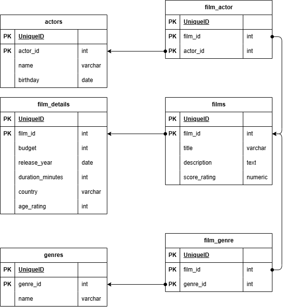

# Лабораторная работа №1. 

Выполнила Аникина Дарья, гр. 6133-010402D

## Предметная область

В рамках лабораторной работы №1 была выбрана система каталогизации фильмов — база данных кинотеки, хранящая информацию о фильмах, актёрах, жанрах и детальных характеристиках кинопроизведений. 

## ER-модель, описание сущностей и связей



В базе данных реализовано 6 сущностей:
* films – таблица, хранящая список фильмов и основную информацию. 
* film-details – таблица, хранящая расширенную информацию по филь-мам. 
* actors – список актеров
* film-actor – таблица, которая хранит список актеров в определенном фильме.
* genres – список жанров фильмов 
* film-genre – таблица, которая хранит список жанров для определенно-го фильма.

Были реализованы следующие связи:
1-1: films и film-details.
1-N: actors и film-actor, films и film-actor, genres и film-genre, film-genre и films.
N:M: реализовано через связь 1-N и таблицы film-actor, film-genre.


## Создание базы данных

Ниже приведён скрипт создания таблицы film_details в качестве примера. Для числовых полей добавлены ограничения целостности: бюджет не может быть отрицательным, год выпуска — не ранее 1900-го, продолжительность — строго положительная. Связь с таблицей `films` реализована через внешний ключ с каскадным удалением.

```sql
CREATE TABLE film_details (
    film_id BIGINT PRIMARY KEY REFERENCES films(film_id) ON DELETE CASCADE,
    budget BIGINT CHECK (budget >= 0),
    release_year INTEGER CHECK (release_year >= 1900),
    duration_minutes INTEGER CHECK (duration_minutes > 0),
    country VARCHAR(100),
    age_rating INT
);
```

## Индексы

Созданы индексы для ускорения наиболее типичных операций поиска и сортировки.

```sql
CREATE INDEX idx_films_title ON films(title);
CREATE INDEX idx_films_score ON films(score_rating);
CREATE INDEX idx_film_actor_film ON film_actor(film_id);
CREATE INDEX idx_film_actor_actor ON film_actor(actor_id);
CREATE INDEX idx_film_genre_film ON film_genre(film_id);
CREATE INDEX idx_film_genre_genre ON film_genre(genre_id);
```

## Типовые запросы

Разработаны следующие типовые запросы к базе данных:

1. Фильмы определённого жанра с идентификаторами

```sql
SELECT
    f.film_id,
    f.title,
    g.name AS genre
FROM films f
JOIN film_genre fg ON f.film_id = fg.film_id
JOIN genres g ON fg.genre_id = g.genre_id
WHERE g.name = 'Action';
```

2. Актёрский состав конкретного фильма
```sql
SELECT
    f.title,
    a.name AS actor_name
FROM films f
JOIN film_actor fa ON f.film_id = fa.film_id
JOIN actors a ON fa.actor_id = a.actor_id
WHERE f.title = 'Film 500';
```

3. Все фильмы, отсортированные по рейтингу
```sql
SELECT
    film_id,
    title,
    score_rating
FROM films
ORDER BY score_rating DESC;
```

4. Средний бюджет фильмов по странам
```sql
SELECT
    fd.country,
    AVG(fd.budget) AS avg_budget
FROM film_details fd
GROUP BY fd.country
ORDER BY avg_budget DESC;
```
5. Актёры с наибольшим количеством ролей
```sql
SELECT
    a.actor_id,
    a.name,
    COUNT(fa.film_id) AS total_films
FROM actors a
JOIN film_actor fa ON a.actor_id = fa.actor_id
GROUP BY a.actor_id, a.name
ORDER BY total_films DESC;
```

## Генерация тестовых данных

Данные генерируются с помощью набора функций, описанных в файле **functions.sql**. Сценарий заполнения в файле **seed.sql** вызывает их последовательно:

```sql
SELECT generate_actors(500000);
SELECT generate_genres();
SELECT generate_films(1000000);
SELECT generate_film_actor(1000000);
SELECT generate_film_genre(1000000);
```

Генерируется **500 000 актёров** — для каждого случайная дата рождения в диапазоне последних ~190 лет. Затем создаются **10 жанров** из фиксированного списка (Action, Drama, Comedy и др.), после чего генерируется **1 000 000 фильмов**.

```sql
INSERT INTO films(title, description, score_rating)
VALUES (
    'Film ' || i,
    'Description for film ' || i,
    ROUND((random() * 10)::numeric, 2)
);
```

Для каждого фильма одновременно создаётся запись в film_details со случайным бюджетом (от 1 до 500 млн долларов), годом выпуска (1980–2025), длительностью (100–160 минут), страной из фиксированного списка из 8 стран и возрастным ограничением.

Связи фильмов с актёрами и жанрами генерируются пакетами по 10 000 записей для эффективной работы с большими объёмами данных и предотвращения переполнения памяти транзакций.


## Анализ производительности запросов

Запросы были проанализированы с помощью EXPLAIN ANALYZE. Результаты приведены в таблице:

| Запрос | Время выполнения |
|---|---|
| Фильмы по жанру | 0,610 мс |
| Актёрский состав фильма | 4,797 мс |
| Все фильмы по рейтингу | 476,100 мс |
| Средний бюджет по странам | 95,177 мс |
| Актёры по количеству ролей | 0,466 мс |

Наиболее медленным оказался третий запрос — сортировка всей таблицы films из 1 000 000 строк по полю score_rating. Запросы 1 и 5 показали отличные результаты менее 1 мс благодаря эффективному использованию существующих индексов на внешних ключах.

## Оптимизация

Запрос 2 (актёрский состав всех фильмов). Запрос соединяет три таблицы через film_actor и возвращает все записи без фильтрации. Существенного ускорения за счёт индексов здесь не добиться — данные читаются целиком. Основное улучшение достигается увеличением параметра work_mem, который определяет объём памяти для каждой отдельной операции сортировки и хеш-соединения. При достаточном work_mem хеш-таблица для JOIN размещается в памяти и не сбрасывается на диск.

В конфигурации PostgreSQL (`postgresql.conf`) были добавлены параметры
```sql

work_mem = 64MB 

# Показываем реальный размер доступной памяти
effective_cache_size = 4GB

# Увеличиваем стоимость random I/O 
random_page_cost = 1.1
```

Запрос 3 (фильмы, отсортированные по рейтингу). Полная сортировка миллиона строк — наиболее затратная операция. Для её ускорения был добавлен индекс с убывающей сортировкой, соответствующей направлению запроса:
```sql
CREATE INDEX idx_films_score_rating ON films(score_rating DESC);
```

Запрос 4 (средний бюджет по странам). Группировка по полю country с агрегацией AVG(budget) выигрывает от составного индекса, охватывающего оба задействованных столбца:

```sql
CREATE INDEX idx_film_details_country_budget ON film_details(country, budget);
```
Благодаря этому индексу планировщик может выполнить Index-Only Scan, не обращаясь к основной таблице за значениями бюджета.


| Запрос | Исходное время | Время после оптимизации | Ускорение |
|---|---|---|---|
| Актёрский состав всех фильмов | 4,797 мс | 0,618 мс | 7,8× |
| Все фильмы по рейтингу | 476,100 мс | 380,368 мс | 1,25× |
| Средний бюджет по странам | 95,177 мс | 64,560 мс | 1,47× |

Наибольший относительный выигрыш получен во втором запросе — обновление статистики позволило планировщику выбрать оптимальный план соединения таблиц. Третий запрос ускорился умеренно: сортировка миллиона строк остаётся затратной операцией, и существенного прогресса здесь можно добиться только введением пагинации на уровне приложения, поскольку возврат всего миллиона записей за раз лишён практического смысла. Четвертый запрос ускорился благодаря составному индексу, сократившему объём читаемых данных.

