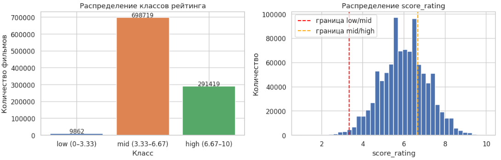
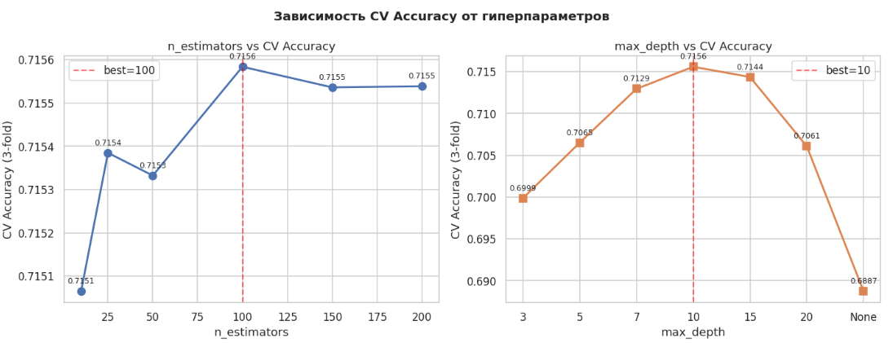
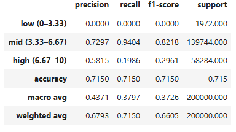

# Лабораторная работа №2. База данных фильмотеки
Выполнила Аникина Дарья, гр. 6133-010402D

## №1

Целью работы является построение модели машинного обучения для прогнозирования рейтинга фильма на основе его характеристик. 

## Выделение значений из базы данных

Для каждого фильма формируется набор характеристик, которые могут влиять на итоговую оценку зрителей.
Пример SQL-запроса для формирования выборки:

```sql

QUERY = """
SELECT
    f.film_id,
    f.score_rating,
    fd.country,
    fd.release_year,
    fd.duration_minutes,
    g.name      AS genre,
    a.actor_id
FROM films f
JOIN film_details fd ON f.film_id  = fd.film_id
JOIN film_genre   fg ON f.film_id  = fg.film_id
JOIN genres       g  ON fg.genre_id = g.genre_id
JOIN film_actor   fa ON f.film_id  = fa.film_id
JOIN actors       a  ON fa.actor_id = a.actor_id
"""
```


## Вектор признаков

Для обучения модели используется следующий набор признаков:

| Признак | Описание |
|---|---|
| country | Страна производства фильма|
| release_year | Год выпуска |
| duration_minutes| Продолжительность фильма |
| genre | Жанр фильма |
| actor_id | Идентификатор ведущего актёра|

Целевой переменной является: score_rating - рейтинг фильма

Для задачи классификации рейтинг был разбит на категории:
* Низкий рейтинг (0–3,33)
* Средний рейтинг (3,33–6,67)
* Высокий рейтинг (6,67–10)



## Предварительная обработка данных

Перед обучением модели были выполнены следующие этапы подготовки данных:

1.	Проверка на пропущенные значения.
2.	Кодирование категориальных признаков (country, genre).
3.	Нормализация числовых признаков.
4.	Разделение данных на обучающую и тестовую выборки.

Размер датасета составил 1 000 000 записей.
Соотношение выборок:
* Обучающая выборка — 80%
* Тестовая выборка — 20%

```sql

X_train, X_test, y_train, y_test = train_test_split(
    X, y, test_size=0.2, random_state=42, stratify=y
)

split_df = pd.DataFrame({
    "Выборка":     ["Train", "Test", "Всего"],
    "Размер":      [len(X_train), len(X_test), len(X_train)+len(X_test)],
    "Доля, %":     [80, 20, 100],
})
display(split_df)
```

## Обучение модели

В качестве алгоритма машинного обучения был выбран Random Forest Classifier.

```sql

clf_best = RandomForestClassifier(
    n_estimators=best_n,
    max_depth=best_d,
    random_state=42,
    n_jobs=-1,
)
clf_best.fit(X_train, y_train)
```
Были подобраны гиперпараметры, самым лучшими сочетанием оказалось: n_estimators=100, max_depth=10



## Результаты

По итогам обучения модель продемонстрировала высокое качество классификации для данных, которые были до этого сгенерированы случайным образом.
Основные результаты:


